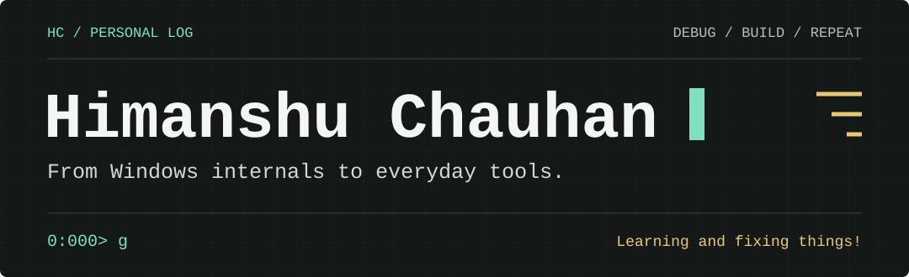

[](https://www.hichauhan.in/)

<p align="center">
	<strong>Windows Debug Engineer @ Microsoft</strong><br>
	<a href="https://www.hichauhan.in/">Website</a> &middot;
	<a href="https://www.linkedin.com/in/hichauhan-in/">LinkedIn</a>
</p>

## `whoami`

I'm **Himanshu Chauhan**. I work close to Windows internals, where understanding a problem often means looking underneath the interface.

I'm interested in how systems behave, why they fail, and what the evidence can tell us. Debugging brings those questions together.

**I like getting past "it works" to "here's why it works."**

## How I think

- **Follow the evidence.** Let what the system is doing guide the next question.
- **Understand the why.** A fix is useful. Knowing why it works is better.
- **Keep learning.** There is usually another layer worth understanding.

## Things I can happily talk about

Memory, threads, drivers, and the small details that change the whole diagnosis. Windows is my home ground, but my curiosity also takes me into automation, AI, and application development.

`Windows internals` `WinDbg` `C / C++` `Python` `Kotlin`

---

```text
0:000> .echo Learning and fixing things!
Learning and fixing things!

0:000> g
```

<p align="center">
	<a href="https://www.hichauhan.in/">Step into my terminal</a> &middot;
	<a href="https://www.linkedin.com/in/hichauhan-in/">Let's connect</a><br>
	<sub>Personal views, not official Microsoft guidance.</sub>
</p>
